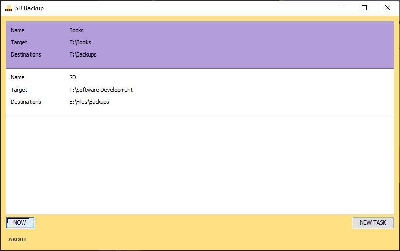

# Example Project: SD Backup

&nbsp;

Basic desktop app that might help to make occasional backups.

## Getting Started

This app runs on Java 8+. There is a list of backup items to add that have a source target (directory to copy) and destinations to copy the files to that/those destinations. A backup is created by clicking the button "NOW".

The destinations look like the following: `T:\Backups\YYYY.MM.dd HH_mm`.

## Screenshots

## Contact

This software: [GitHub Repository](https://github.com/tobiasbriones/ep-sd-backup)

Tobias Briones: [GitHub](https://github.com/tobiasbriones)

Example Project: [App](https://tobiasbriones.github.io/example-project)

## About

**Example Project: SD Backup**

Basic desktop app that might help to make occasional backups.

Copyright © 2018-2021 Tobias Briones. All rights reserved.

### License

This project is licensed under the [MIT License](./LICENSE).
